# 🎯 Fine-Tuning Guide - Complete Workflow

A comprehensive guide to customizing AI models with your own training data.

## Table of Contents

- [What is Fine-Tuning?](#what-is-fine-tuning)
- [When to Use Fine-Tuning](#when-to-use-fine-tuning)
- [Quick Start](#quick-start)
- [Step-by-Step Workflow](#step-by-step-workflow)
- [Data Format Guide](#data-format-guide)
- [Best Practices](#best-practices)
- [Troubleshooting](#troubleshooting)
- [FAQs](#faqs)

---

## What is Fine-Tuning?

Fine-tuning is the process of training an existing AI model on your custom data to improve its performance for specific tasks. Think of it as teaching a general-purpose AI to become an expert in your domain.

### How It Works (Visual)


### Benefits:
- ✅ **Better accuracy** - Model learns your specific terminology and patterns
- ✅ **Consistent responses** - Maintains your brand voice and style
- ✅ **Domain expertise** - Understands industry-specific concepts
- ✅ **Cost effective** - Smaller prompts, better results

### Example Use Cases:
- Customer support with company-specific policies
- Technical documentation writer with your coding standards
- Sales assistant with your product knowledge
- Content creator matching your brand voice

---

## When to Use Fine-Tuning

### Decision Flowchart

```mermaid
graph TD
    A[Need to customize AI?] --> B{Have 100+ examples?}
    B -->|Yes| C{Need specific patterns?}
    B -->|No| D[Use Prompt Engineering]
    C -->|Yes| E{Task changes often?}
    C -->|No| D
    E -->|No| F[✅ Use Fine-Tuning!]
    E -->|Yes| G[Consider RAG/Prompting]
    
    style F fill:#4caf50,color:#fff
    style D fill:#ff9800,color:#fff
    style G fill:#2196f3,color:#fff
```



### ✅ Fine-Tuning is Great For:

- You have **100+ high-quality examples**
- Responses need to follow **specific patterns**
- You want **consistent formatting** (JSON, markdown, etc.)
- The task requires **domain-specific knowledge**
- You're making **many similar API calls**

### ❌ Consider Alternatives If:

- You have **less than 50 examples** (use prompting instead)
- Your task changes frequently (fine-tuning takes time)
- You need real-time information (use RAG/Knowledge Base)
- The task is simple (prompt engineering works better)

---

## Quick Start

### 5-Minute Setup

1. **Navigate to Fine-Tuning**
   ```
   Dashboard → Fine-Tuning
   ```

2. **Choose Your Path**:
   - Have data already? → **Upload Dataset**
   - Have CSV/JSON? → **Convert Data**
   - Have chat history? → **Import Conversations**

3. **Start Training**
   - Select your dataset
   - Choose base model
   - Click "Start Training"

4. **Deploy Model**
   - Wait for training to complete (monitor in Background Jobs)
   - Deploy to an agent
   - Start using your custom model!

---

## Step-by-Step Workflow

### Complete Workflow Diagram


### Step 1: Prepare Your Training Data

You need conversation examples in JSONL format. Each line contains:

```jsonl
{"messages": [{"role": "system", "content": "You are a helpful assistant."}, {"role": "user", "content": "What is photosynthesis?"}, {"role": "assistant", "content": "Photosynthesis is the process by which plants..."}]}
{"messages": [{"role": "system", "content": "You are a helpful assistant."}, {"role": "user", "content": "Explain gravity."}, {"role": "assistant", "content": "Gravity is a force of attraction..."}]}
```

#### Option A: Upload Existing JSONL File

**Steps:**
1. Go to **Fine-Tuning → Upload Dataset**
2. Click **"Upload Dataset"**
3. Fill in:
   - Name: "Customer Support Training"
   - Description: "500 examples from Q&A database"
   - Format: JSONL
4. Upload your `.jsonl` file
5. Click **"Create Dataset"**

**Requirements:**
- File format: `.jsonl`
- Valid JSON on each line
- Contains `messages` array
- Each message has `role` and `content`

---

#### Option B: Convert CSV/JSON Data

**If you have data in CSV or JSON format, use the Data Conversion Wizard!**

**Conversion Workflow:**


**Steps:**

1. **Navigate to Conversion**
   ```
   Fine-Tuning → Convert Data (CSV/JSON)
   ```

2. **Upload Your File**
   - Drag & drop or click to upload
   - Supports: `.csv`, `.json`, `.jsonl`
   - File size: up to 100MB

3. **Analyze Data**
   - System analyzes your columns
   - Shows total rows and sample data
   - Click **"Next: Configure"**

4. **Choose Conversion Mode**

   **Conversion Modes Comparison:**

   ```mermaid
   graph TD
       subgraph Guided Mode
           G1[Select Template] --> G2[Map Columns]
           G2 --> G3[Configure Options]
           G3 --> G4[Generate Examples]
       end
       
       subgraph Smart Mode
           S1[Select AI Model] --> S2[AI Analyzes Data]
           S2 --> S3[AI Generates Patterns]
           S3 --> S4[Create Diverse Examples]
       end
       
       G4 --> Output[JSONL Dataset]
       S4 --> Output
       
       style Guided Mode fill:#e3f2fd
       style Smart Mode fill:#f3e5f5
   ```

   **🎯 Guided Mode** (Template-based):
   - Select a template:
     - **Q&A** - Question and answer pairs
     - **Info Extraction** - Extract structured info
     - **Classification** - Categorize inputs
     - **Custom** - Define your own pattern
   
   - Map your columns:
     - Key Column: Main input (e.g., "question")
     - Target Column: Expected output (e.g., "answer")
   
   - Configure options:
     - System message (optional)
     - Multi-turn conversations (optional)
     - Columns to include

   **🤖 Smart Mode** (AI-powered):
   - Select AI provider (Ollama or OpenAI)
   - Choose model (e.g., llama3.2, mistral)
   - Set examples per row (1-5)
   - AI generates diverse training examples

5. **Preview Examples**
   - Review sample conversions
   - Verify format looks correct
   - See estimated total examples

6. **Convert & Create Dataset**
   - Enter dataset name
   - Add description (optional)
   - Click **"Convert & Create Dataset"**
   - Monitor progress in real-time

**Tips:**
- **Guided Mode**: Fast, predictable, template-based
- **Smart Mode**: Creative, diverse, requires AI model
- Start with Guided mode for simple data
- Use Smart mode for complex patterns

---

#### Option C: Import from Conversations

**Use your existing chat history as training data!**

**Steps:**

1. Go to **Fine-Tuning → Import Conversations**
2. Filter conversations:
   - Date range
   - Specific agent
   - Minimum quality score
   - Max examples to import
3. Review selected conversations
4. Click **"Import as Dataset"**

**Benefits:**
- Real conversations with users
- Already validated responses
- Quick to set up

**Limitations:**
- May need cleanup
- Limited to available conversations
- Might include errors

---

### Step 2: Validate Your Dataset

**Automatic validation checks:**

1. Navigate to **Fine-Tuning → Datasets**
2. Find your dataset
3. Click **"Validate"** if not already validated

**What gets validated:**
- ✅ Correct JSONL format
- ✅ Required fields present
- ✅ Token count within limits
- ✅ Conversation structure
- ✅ Message roles valid

**Validation Status:**
- 🟢 **Validated** - Ready for training!
- 🔴 **Failed** - Errors found, need fixing
- ⚪ **Not Validated** - Not checked yet

---

### Step 3: Create Fine-Tuning Job

**Ready to train your model!**

**Steps:**

1. Go to **Fine-Tuning → Start Training**
2. Fill in job details:

   **Job Name:**
   ```
   Example: "Customer Support - GPT-3.5 - v1"
   ```

   **Description (optional):**
   ```
   Example: "First training run with 500 Q&A examples"
   ```

   **Select Dataset:**
   - Choose from your validated datasets
   - See example count and format

   **Base Model:**
   - **OpenAI**:
     - `gpt-3.5-turbo` (Recommended - fast & cost-effective)
     - `gpt-4` (Most capable, expensive)
   - **Ollama** (Local):
     - `llama3.2` (Recommended)
     - `llama2`, `mistral`, `phi`, `gemma`

   **Hyperparameters (Advanced):**
   - Epochs: 3 (default) - Number of training cycles
   - Learning Rate: auto (recommended)
   - Batch Size: auto (recommended)

3. **Estimate Cost** (OpenAI only)
   - Click "Estimate Cost"
   - See estimated USD amount
   - Training time estimate

4. **Start Training**
   - Click **"Create Fine-Tuning Job"**
   - Job starts automatically
   - Redirected to job details

---

### Step 4: Monitor Training Progress

**Your job is now running in the background!**

**Training Progress Flow:**


**Real-time Status Updates:**


**View Progress:**

1. **Background Jobs Dashboard**
   ```
   Dashboard → Background Jobs
   ```
   - See all jobs in one place
   - Real-time progress updates
   - Current status and percentage

2. **Fine-Tuning Jobs Page**
   ```
   Fine-Tuning → Jobs
   ```
   - Filter by status
   - View job history
   - See training metrics

**Job Statuses:**
- ⏳ **Pending** - Waiting in queue
- 🔄 **Validating** - Checking dataset
- 🏃 **Running** - Training in progress
- ✅ **Succeeded** - Training complete!
- ❌ **Failed** - Training failed
- 🚫 **Cancelled** - Manually stopped

**During Training:**
- Progress percentage (0-100%)
- Current step/phase
- Tokens trained
- Training loss (lower is better)
- Estimated time remaining

**What Happens:**
1. Dataset validation (0-10%)
2. Job submission to provider (10-20%)
3. Training (20-95%)
   - Provider polls every 30 seconds
   - Updates progress in real-time
4. Model creation (95-100%)
5. Completion notification

**Actions Available:**
- **View Details** - See full job information
- **Cancel** - Stop running job (if needed)
- **Retry** - Retry failed jobs

---

### Step 5: Deploy Your Model

**Training complete! Time to use your custom model.**

**Steps:**

1. **View Your Model**
   ```
   Fine-Tuning → Models
   ```
   - Find your newly trained model
   - Status should be "Active"

2. **Deploy to Agent**
   - Click on your model
   - Click **"Deploy to Agent"**
   - Select target agent
   - Confirm deployment

3. **Test Your Model**
   - Go to **Conversations**
   - Start new conversation with your agent
   - Ask questions similar to training data
   - Verify responses match expected style

**Model Details:**
- Provider model ID (for API use)
- Base model used
- Training job reference
- Final loss metric
- Created date
- Deployment status

---

## Data Format Guide

### Data Format Architecture


### JSONL Structure

**Basic Example:**
```jsonl
{"messages": [{"role": "system", "content": "You are a helpful assistant."}, {"role": "user", "content": "Hello"}, {"role": "assistant", "content": "Hi! How can I help?"}]}
```

### Message Roles

1. **system** (optional but recommended)
   - Sets the AI's behavior
   - Same across all examples recommended
   ```json
   {"role": "system", "content": "You are a professional customer support agent."}
   ```

2. **user**
   - The customer/user question or input
   ```json
   {"role": "user", "content": "How do I reset my password?"}
   ```

3. **assistant**
   - Your desired AI response
   ```json
   {"role": "assistant", "content": "To reset your password, go to Settings → Security → Reset Password."}
   ```

### Multi-Turn Conversations

**Include context for better training:**

```jsonl
{"messages": [
  {"role": "system", "content": "You are a helpful assistant."},
  {"role": "user", "content": "What's your return policy?"},
  {"role": "assistant", "content": "We offer 30-day returns for unused items."},
  {"role": "user", "content": "What about opened items?"},
  {"role": "assistant", "content": "Opened items can be returned within 14 days with a 20% restocking fee."}
]}
```

### CSV Format (for Conversion)

**Simple Q&A:**
```csv
question,answer
"What is your return policy?","30-day returns on unused items"
"Do you ship internationally?","Yes, we ship to over 50 countries"
```

**With System Message:**
```csv
system,user,assistant
"You are a sales assistant","What's the price?","The base price is $99"
"You are a sales assistant","Any discounts?","Yes, 10% off for first-time customers"
```

### JSON Format (for Conversion)

**Array of Objects:**
```json
[
  {
    "question": "What is AI?",
    "answer": "Artificial Intelligence is..."
  },
  {
    "question": "What is ML?",
    "answer": "Machine Learning is..."
  }
]
```

---

## Best Practices

### Quality vs Quantity


### Iterative Improvement Process


### Data Quality

#### ✅ Do:
- Use **real examples** from your domain
- Ensure **consistent formatting** in responses
- Include **diverse scenarios** (edge cases, variations)
- Keep responses **concise and accurate**
- Use **100-1000+ examples** (more is better)
- Include **system message** for context
- Review and **clean data** before training

#### ❌ Don't:
- Use **low-quality** or **inconsistent** examples
- Include **contradictory** information
- Train on **outdated** data
- Use **very long** responses (>4000 tokens)
- Mix **multiple writing styles**
- Include **personal/sensitive** data

### Model Selection Decision Tree


### Training Tips

1. **Start Small**
   - Begin with 100-200 examples
   - Test the model
   - Add more examples iteratively

2. **Version Your Models**
   - Use clear naming: "Support-v1", "Support-v2"
   - Track what changed between versions
   - Keep notes on improvements

3. **Monitor Performance**
   - Test on held-out examples
   - Compare to base model
   - Track user feedback

4. **Iterate**
   - Fine-tuning is iterative
   - Collect failure cases
   - Add to training data
   - Retrain periodically

### Cost Optimization

**OpenAI:**
- Start with `gpt-3.5-turbo` (cheaper)
- Use 3 epochs (don't over-train)
- Clean data to reduce token count
- Batch multiple jobs if possible

**Ollama:**
- Free! Run locally
- Good for experimentation
- Privacy-friendly
- Slower than OpenAI

---

## Troubleshooting

### Troubleshooting Flowchart


### Dataset Issues

**Problem: "Dataset validation failed"**
- **Solution**: Check error details
  - Invalid JSON? Use JSONLint to validate
  - Missing fields? Ensure all required fields present
  - Token limit exceeded? Shorten responses

**Problem: "File format not supported"**
- **Solution**: Convert to JSONL
  - Use Data Conversion wizard
  - Ensure `.jsonl` extension
  - One JSON object per line

**Problem: "Not enough training examples"**
- **Solution**: Need minimum 10 examples (100+ recommended)
  - Add more examples
  - Use data augmentation
  - Import from conversations

### Training Issues

**Problem: "Training failed"**
- **Possible causes**:
  - Invalid dataset (revalidate)
  - Provider API error (retry)
  - Insufficient credits (OpenAI)
  - Model not available (Ollama)

**Problem: "Job stuck in queue"**
- **Solution**:
  - Check Background Jobs dashboard
  - Verify Redis is running
  - Restart backend if needed
  - Cancel and retry if necessary

**Problem: "Model not improving"**
- **Possible causes**:
  - Inconsistent training data (review examples)
  - Too few examples (add more)
  - Wrong hyperparameters (use defaults)
  - Base model inappropriate (try different model)

### Deployment Issues

**Problem: "Model not in agent dropdown"**
- **Solution**:
  - Wait for training to complete
  - Refresh page
  - Check model status is "Active"
  - Verify model in Fine-Tuning → Models

**Problem: "Model responses still generic"**
- **Possible causes**:
  - Not enough training data
  - Data doesn't match use case
  - Need to retrain with better examples
  - System prompt needs adjustment

---

## FAQs

### General

**Q: How long does fine-tuning take?**
A: Depends on dataset size and provider:
- OpenAI: 10 minutes to 2 hours
- Ollama: 30 minutes to several hours
- Monitor in Background Jobs dashboard

**Q: How much does it cost?**
A: 
- **OpenAI**: ~$0.008 per 1K tokens (use cost estimator)
- **Ollama**: Free (runs locally)

**Q: Can I fine-tune multiple times?**
A: Yes! Create multiple datasets and jobs. Iterate and improve.

**Q: Do I need to retrain periodically?**
A: Recommended if:
- Your data/domain changes
- You collect new examples
- Performance degrades
- Every 3-6 months as best practice

### Technical

**Q: What's the difference between fine-tuning and RAG?**

A: They serve different purposes:


- **Fine-tuning**: Trains model on examples, better for style/format
- **RAG (Knowledge Base)**: Retrieves relevant docs, better for facts
- **Best**: Use both! Fine-tune for style, RAG for current info

**Q: Can I use my fine-tuned model in API?**
A: Yes! Get the provider model ID from model details.

**Q: What's the token limit?**
A: 
- OpenAI: 4,096 tokens per example
- Ollama: Model-dependent (usually 2048-4096)

**Q: Can I download my fine-tuned model?**
A:
- OpenAI: No, hosted by OpenAI
- Ollama: Yes, model files stored locally

### Data

**Q: What if I don't have training data?**
A:
- Use Data Conversion with AI (generates examples)
- Import from conversations
- Create manually (start with 50-100)
- Use templates and variations

**Q: Can I mix different data sources?**
A: Yes! Combine:
- Uploaded datasets
- Converted data
- Imported conversations
- Just ensure consistent quality

**Q: How do I improve poor results?**
A:
1. Review training examples
2. Add more diverse examples
3. Fix inconsistencies
4. Add edge cases
5. Retrain with improved data

---

## Next Steps

### After Fine-Tuning

1. **Test Thoroughly**
   - Try various questions
   - Compare to base model
   - Get user feedback

2. **Monitor Performance**
   - Track response quality
   - Collect failure cases
   - Plan improvements

3. **Iterate**
   - Add new examples
   - Retrain periodically
   - Version your models

4. **Scale**
   - Deploy to more agents
   - Fine-tune for other tasks
   - Build model library

### Resources

- 📚 [Data Format Specification](./DATA-FORMAT-SPEC.md)
- 🎯 [Best Practices Guide](./FINE-TUNING-BEST-PRACTICES.md)
- 🔧 [API Reference](./API-REFERENCE.md)
- 💬 [Community Forum](https://community.example.com)
- 📧 [Support](mailto:support@example.com)

---

## Summary Checklist

### Your Fine-Tuning Journey


### Checklist

- [ ] Understand when to use fine-tuning
- [ ] Prepare training data (100+ examples)
- [ ] Upload or convert dataset to JSONL
- [ ] Validate dataset
- [ ] Create fine-tuning job
- [ ] Monitor training progress
- [ ] Deploy model to agent
- [ ] Test and iterate
- [ ] Collect feedback
- [ ] Retrain periodically

**Happy Fine-Tuning! 🚀**

Need help? Check the troubleshooting section or contact support.
